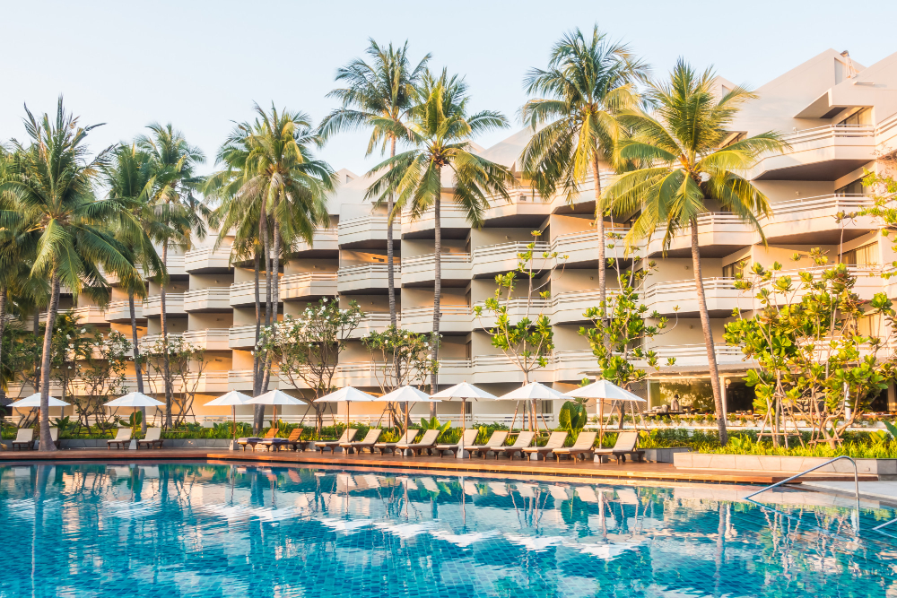

### 2. Top 5 Destinos para Lua de Mel

Celebre o amor em destinos espetaculares!

## 1. Maldivas
Ilhas paradisíacas e bangalôs sobre as águas.

[Reserve sua viagem para as Maldivas](https://link_para_reserva3.com)

## 2. Paris
A cidade mais romântica do mundo.

[Reserve sua viagem para Paris](https://link_para_reserva4.com)

## 3. Veneza
A cidade dos canais e das gôndolas.

[Reserve sua viagem para Veneza](https://link_para_reserva5.com)

## 4. Santorini
A ilha grega com as casinhas brancas e o mar azul.

[Reserve sua viagem para Santorini](https://link_para_reserva6.com)

## 5. Bali
A ilha dos templos e das praias paradisíacas.

[Reserve sua viagem para Bali](https://link_para_reserva7.com)

---